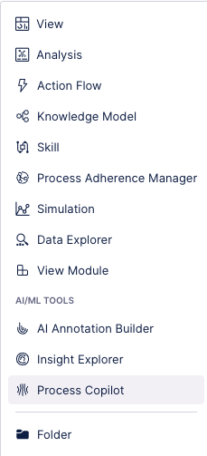
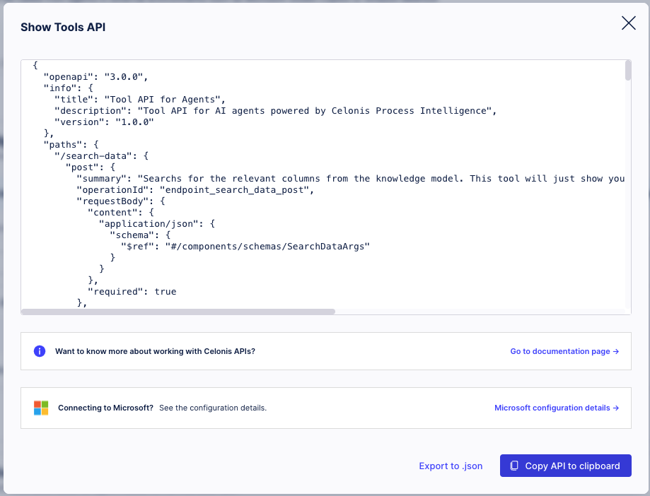
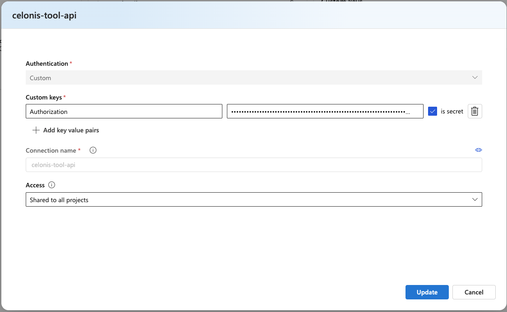
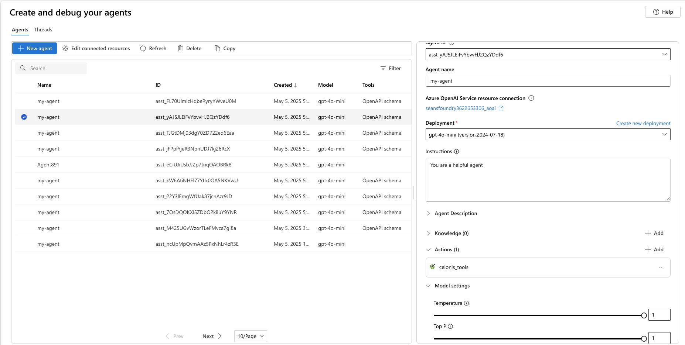
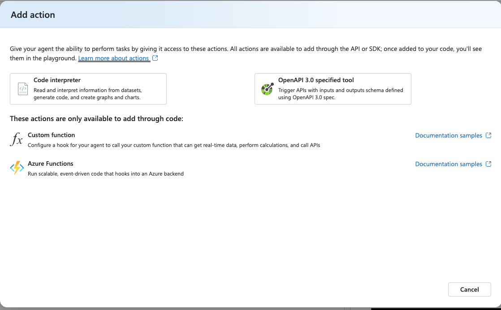
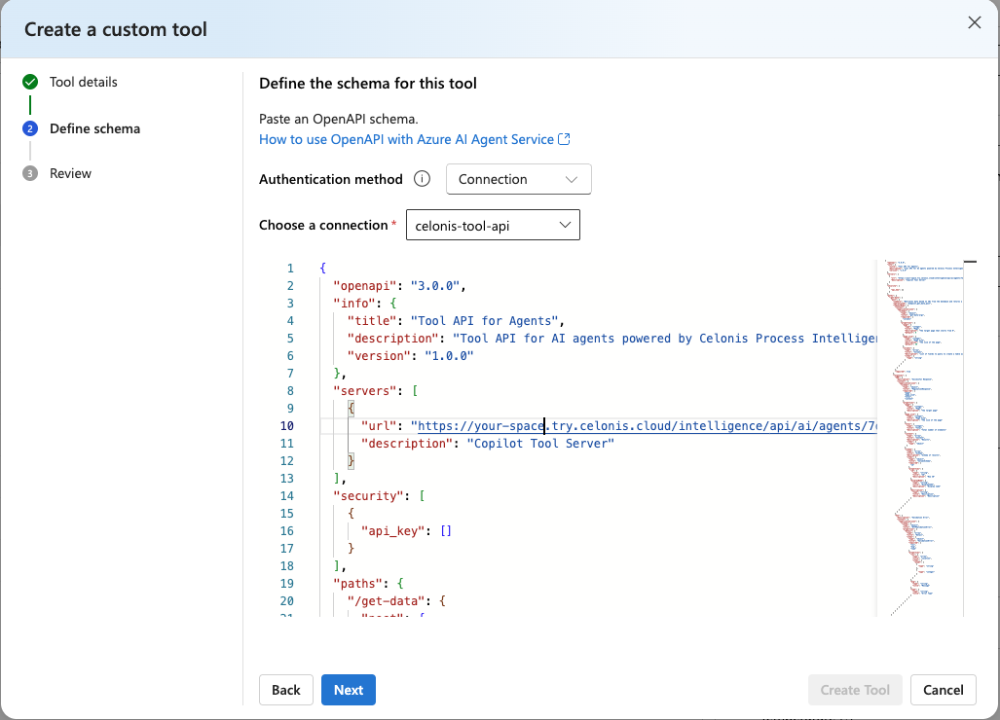

# Celonis
## Description
Celonis delivers Process Intelligence to accelerate enterprise AI at scale.

## Prerequisites
1. A Celonis account with access to Celonis Studio.
2. A configured Celonis Space. see: [Creating Celonis Spaces](https://docs.celonis.com/en/creating-and-managing-spaces.html#UUID-f8796acf-97a6-29ab-bd8e-d2fd69290b76_section-idm4516530993352033996293100881).
3. A configured Celonis Package. see: [Creating Celonis Packages](https://docs.celonis.com/en/creating-packages.html#UUID-e7e82c62-a7d9-4bfd-94cf-c91d0a50ee93_section-idm460319185541763400265934993).
4. The Prerequisites for using a Process copilot. see: [Prerequisites for using a Process Copilot](https://docs.celonis.com/en/process-copilot.html#UUID-fedab4cb-9b0b-19b7-e20c-08f1fb60dc65_section-idm4560783293692834307354778532).


## Create Your Celonis Tools API
### Create the Celonis Copilot Asset
1. In studio, navigate to the space where you want to define your tools API.
2. In the space, navigate to the package where you want to define your tools API.
3. In the panel on the left, click on the **New asset** and select Process Copilot.



4. In the Create Process Copilot Window, enter a name, select the knowledge model, select **Tools for your external Agent**, and click **Create**.


5. Select the Knowledge Input. See: [Knowledge Input](https://docs.celonis.com/en/knowledge-input.html)

6. Select the Tools. These are the set of tools your agent will have access to. See: [Tool Activation](https://docs.celonis.com/en/tool-activation.html). For the tool API, you can select from **Get Data**, **Get Insights**, **PQL Tool**, and **Trigger Action Flow**.  **Search Agent** will be added automatically. Our example API uses **Search Data**, **Get Data**, and **Get Insights**.

7. Click **Publish** in the upper right, then click **Publish** in the window that appears.


8. Click **Show Tools API** in the upper right and then, click **Copy API to Clipboard** in the window that appears.



## Add your API Key to Azure AI Foundry
1. Create and save a Celonis API key. See [Creating API Keys](https://docs.celonis.com/en/creating-api-keys.html).

2. Go to your [Azure AI foundry Portal](https://ai.azure.com/). Go to **Management Center** and select **+new connection**. Select **Custom keys** in **other resource types**.


3. When you get to the **Connect a custom resource** window:
    1. Set **Custom keys** to "Authorization" with the value being 
    "Bearer YOUR_API_KEY".
    2. Make sure **secret** is checked.
    3. Set the connection name.
    4. Select **Access**.





## Use Celonis through the Foundry Portal

1. To use the Celonis tool in the Azure AI foundry, in the **Create and debug** screen for your agent, scroll down the **Setup** pane on the right to **Actions**. Then select **Add**.


2. Select **OpenAPI 3.0 specified tool**


3. Create the tool
    1. Give a name and a description for the tool that will help the model understand the functionality.

    2. Define the Schema. Make sure the authentication method is set to **Connection**. For **Choose a connection**, use the connection name of the connection you made [above](#add-your-api-key-to-azure-ai-foundry)

    3. Paste the OpenAPI schema you created in [Create Your Celonis Tools API](#create-your-celonis-tools-api). 
    
    *Note*: `tool_api.json` in this repo is just an example. you must use your own OpenAPI spec you got from Celonis.



4. Finish and start chatting.


## Connect Celonis Through Code-First Experience
1. Locally store the OpenAPI schema you created in [Create Your Celonis Tools API](#create-your-celonis-tools-api)


2. Make sure you have updated the authentication method to be `connection`.

3.  Find the connection you made in [Add your API Key to Azure AI Foundry
](#add-your-api-key-to-azure-ai-foundry) and set its ID as the `CONNECTION_ID` environment variable. The connection ID  should be in the format "/subscriptions/\<sub-id>/resourceGroups/\<your-rg-name>/providers/Microsoft.CognitiveServices/accounts/\<your-ai-services-name>/projects/\<your-project-name>/connections/\<your-connection-name>"
```python
import os 

auth= OpenApiConnectionAuthDetails(
        security_scheme=OpenApiConnectionSecurityScheme(
            connection_id=os.environ["CONNECTION_ID"]
        )
    )
```

## Support
For support see: [customer support](https://docs.celonis.com/en/support.html).

[def]: #add
